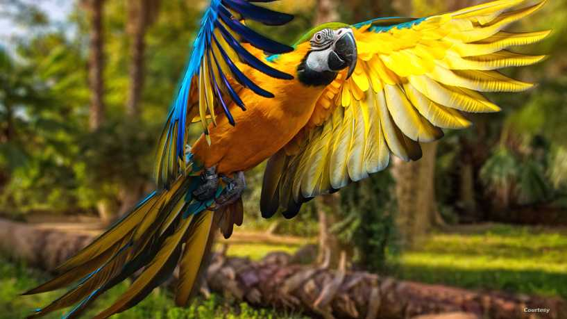

# GrayScale Conversion


In order to convert a color image to Grayscale image, you need to read pixels or data of the image using File and ImageIO objects, and store the image in BufferedImage object. Its syntax is given below

```
BufferedImage source_img;
try {
	source_img = ImageIO.read(new File("/Users/dabbaghie/eclipse-workspace/GrayFilter/ba.jpg"));
	ImageIO.write(image_result, "PNG", new File("answer.png"));
		} catch (IOException e) {
			// TODO Auto-generated catch block
			e.printStackTrace();
      }
```

An image contains a two dimensional array of pixels. It is actually the value of those pixels that make up an image. Usually an image could be color or grayscale.

In Java, the BufferedImage class is used to handle images. You need to call getRGB() method of the BufferedImage class to get the value of the pixel.

```
for(int y = 0 ; y < source_img.getHeight() ; y++) {
   for(int x = 0 ; x < source_img.getWidth() ; x++) {
	Color pix =new Color(source_img.getRGB(x, y));
	float Red=pix.getRed();
	float Blue=pix.getBlue();
        float Green=pix.getGreen();
        }
     }
```
<h5>Getting Pixel Value</h5>
The pixel value can be received using the following syntax−

```
Color c = new Color(source_img.getRGB(j, i));
```
<h5>Getting RGB Values</h5>
The method getRGB() takes the row and column index as a parameter and returns the appropriate pixel. In case of color image, it returns three values which are (Red, Green, Blue). They can be get as follows

```
c.getRed();
c.getGreen();
c.getBlue();

```

<h5>Getting Width and Height of Image</h5>
The height and width of the image can be get by calling the getWidth() and getHeight() methods of the BufferedImage class. Its syntax is given below

```
int width = source_img.getWidth();
int height = source_img.getHeight();

```


By decreasing the value of red color and increasing the value of green color and the value for blue color will be between these two colors.

The equation for a new grayscale image will be:

<a href="https://static.javatpoint.com/tutorial/dip/images/dip-grayscale-to-rgb-conversion3.png"></a>

According to the above equation, red is used 30%, green is used 59%, and blue is used 11%. The contribution of green is highest.
```
int newRed= (int) Math.round ((Red * 0.299));
int newBlue=(int) Math.round ((Blue * 0.114));
int newGreen=(int) Math.round ((Green * 0.587));
```
The last step is to add all these three values and set it again to the corresponding pixel value. Its syntax is given below 

```
int sum = newRed + newBlue +newGreen;
image_result.setRGB(x, y, new Color(sum,sum,sum).getRGB());
```

By Applying the equation in an image, we will get:

<a href="GrayFilter/ba.jpg"></a>
<a href="GrayFilter/answer.png"></a>

